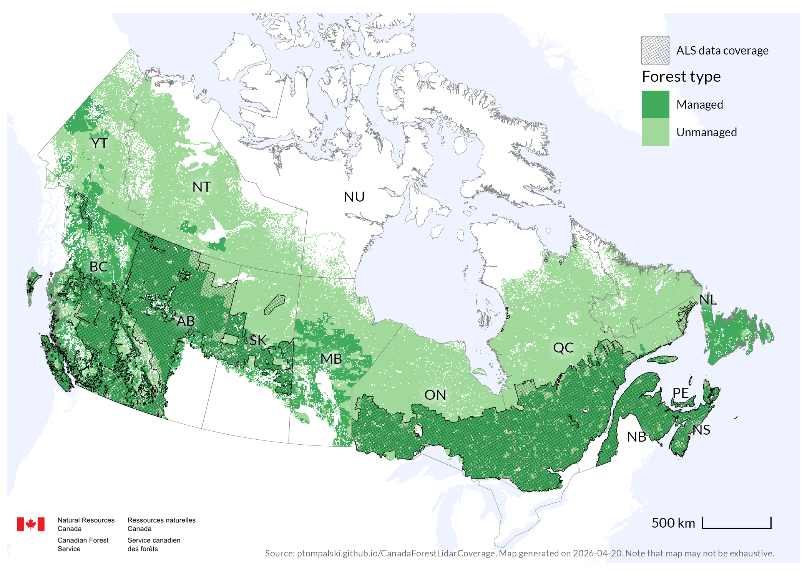

# ALS data coverage in Canadian forests

This repository is used to track the current status of airborne laser scanning (ALS) data coverage across Canada's forested landscapes.

The maps and summaries focus on ALS data that are relevant to forestry. ALS acquisitions outside Canada's forested ecozones, for example in urban areas, or data acquired for research projects are generally not included.

The most recent maps, tables, update log, and data source notes are available on the project website:

<https://ptompalski.github.io/CanadaForestLidarCoverage/>

## Most recent coverage map

## Notes

This repository accompanies White et al. (2025), *Enhanced forest inventories in Canada: implementation, status, and research needs*. It is intended to keep the maps and statistics presented in the paper up to date.

Information about the source data and ALS data availability by jurisdiction is provided on the website.
