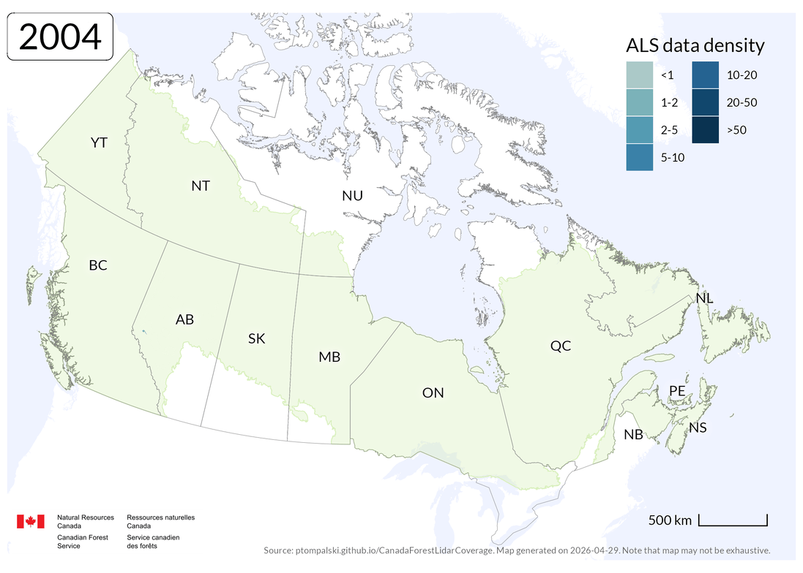

<style>
#title-block-header {
  display: none;
}
</style>

```{r, echo=FALSE, warning=FALSE, message=FALSE}
source("R/0000_setup.R")

library(dplyr)
library(fs)
library(ggiraph)
library(ggtext)
library(htmltools)

Stats <- readRDS("layers/Stats.rds")
theTable <- Stats$theTable

total_ALS_area <- Stats$total_ALS_area
total_ALS_perc <- round(Stats$total_ALS_perc, 1)
managed_ALS_perc <- round(Stats$managed_ALS_perc, 1)
forested_ALS_perc <- round(Stats$forested_ALS_perc, 1)

summary_multitemporal_list <- readRDS("layers/summary_multitemporal_list.rds")
summary_multitemporal_Canada <- summary_multitemporal_list$summary_multitemporal_Canada
summary_multitemporal_managed <- summary_multitemporal_list$summary_multitemporal_managed

total_ALS_area_million <- round(total_ALS_area / 1000000, 2)
multitemporal_area <- as.numeric(summary_multitemporal_Canada$total_multitemporal_ALS_area)
multitemporal_area_million <- round(multitemporal_area / 1000000, 2)
multitemporal_canada_perc <- round(summary_multitemporal_Canada$total_multitemporal_ALS_area_prop, 1)
multitemporal_managed_perc <- round(summary_multitemporal_managed$total_managed_multitemporal_ALS_area_prop, 1)
```

```{r, echo=FALSE, warning=FALSE, message=FALSE, results='asis'}
browsable(
  tagList(
    tags$section(
      class = "column-screen homepage-intro-band",
      tags$div(
        class = "homepage-hero-copy",
        tags$p(class = "homepage-eyebrow", "National ALS coverage overview"),
        tags$h1("ALS data coverage in Canadian forests"),
        tags$p(
          class = "homepage-hero-lede",
          "Explore airborne laser scanning coverage across Canada's forested landscapes, with national extent, acquisition timing, and density patterns prepared for forestry applications."
        ),
        tags$div(
          class = "homepage-hero-actions",
          tags$a(href = "maps.html", class = "homepage-button homepage-button-primary", "Explore maps"),
          tags$a(href = "data.html", class = "homepage-button homepage-button-secondary", "Data access")
        ),
        tags$section(
          class = "homepage-stats-band homepage-stats-band-hero",
          tags$div(
            class = "homepage-stats-grid",
            tags$article(
              class = "homepage-stat",
              tags$p(class = "homepage-stat-label", "Total ALS coverage"),
              tags$p(
                class = "homepage-stat-value",
                tags$span(class = "homepage-stat-number", `data-target` = total_ALS_area_million, `data-decimals` = 2, "0"),
                tags$span(class = "homepage-stat-suffix", HTML("M km<sup>2</sup>"))
              ),
              tags$p(class = "homepage-stat-detail", sprintf("%.1f%% of Canada's land area", total_ALS_perc))
            ),
            tags$article(
              class = "homepage-stat",
              tags$p(class = "homepage-stat-label", "Forested ecozones covered"),
              tags$p(
                class = "homepage-stat-value",
                tags$span(class = "homepage-stat-number", `data-target` = forested_ALS_perc, `data-decimals` = 1, "0"),
                tags$span(class = "homepage-stat-suffix", "%")
              ),
              tags$p(class = "homepage-stat-detail", "Coverage across Canada's forested ecozones")
            ),
            tags$article(
              class = "homepage-stat",
              tags$p(class = "homepage-stat-label", "Managed forests covered"),
              tags$p(
                class = "homepage-stat-value",
                tags$span(class = "homepage-stat-number", `data-target` = managed_ALS_perc, `data-decimals` = 1, "0"),
                tags$span(class = "homepage-stat-suffix", "%")
              ),
              tags$p(class = "homepage-stat-detail", "Managed forest area with ALS coverage")
            ),
            tags$article(
              class = "homepage-stat",
              tags$p(class = "homepage-stat-label", "Multitemporal ALS area"),
              tags$p(
                class = "homepage-stat-value",
                tags$span(class = "homepage-stat-number", `data-target` = multitemporal_area_million, `data-decimals` = 2, "0"),
                tags$span(class = "homepage-stat-suffix", HTML("M km<sup>2</sup>"))
              ),
              tags$p(
                class = "homepage-stat-detail",
                sprintf("%.1f%% of Canada and %.1f%% of managed forests", multitemporal_canada_perc, multitemporal_managed_perc)
              )
            )
          )
        )
      )
    ),
    tags$section(
      class = "column-screen homepage-map-band",
      tags$iframe(
        class = "homepage-map-frame",
        src = "home-map.html",
        title = "Interactive ALS coverage map",
        loading = "lazy"
      )
    )
  )
)
```

## About the coverage

```{r, echo=FALSE, warning=FALSE, message=FALSE, results='asis'}
browsable(
  tags$section(
    class = "homepage-detail-grid",
    tags$div(
      tags$p(class = "homepage-section-kicker", "What this site tracks"),
      tags$p(
        class = "homepage-body-copy",
        "This website summarizes airborne laser scanning coverage across Canada's forested landscapes. It focuses on acquisitions relevant to forestry and excludes urban ALS programs and research-only collections outside the forested ecozones."
      ),
      tags$p(
        class = "homepage-body-copy",
        HTML("The site is updated to keep the national overview, acquisition statistics, and jurisdictional summaries aligned with the current state of public ALS availability. Source-specific update timing and access notes are documented on the <a href='data.html'>Data access</a> page.")
      )
    ),
    tags$div(
      class = "homepage-reference-panel",
      tags$p(class = "homepage-section-kicker", "Reference"),
      tags$p(
        class = "homepage-body-copy",
        HTML("This website accompanies <a href='https://doi.org/10.1139/cjfr-2024-0255'>White et al. 2025</a> and extends the publication with updated coverage estimates, current source notes, and map products that can be revisited as new ALS acquisitions become available.")
      ),
      tags$p(
        class = "homepage-reference-citation",
        HTML("White, J.C., Tompalski, P., Bater, C.W., Wulder, M.A., Fortin, M., Hennigar, C., Robere-McGugan, G., Sinclair, I., White, R. (2025). <strong>Enhanced forest inventories in Canada: implementation, status, and research needs.</strong> Canadian Journal of Forest Research, 55: 1-37.")
      )
    )
  )
)
```

## Explore the site

```{r, echo=FALSE, warning=FALSE, message=FALSE, results='asis'}
nav_card <- function(href, eyebrow, title, description) {
  tags$a(
    class = "homepage-nav-card",
    href = href,
    tags$span(class = "homepage-nav-eyebrow", eyebrow),
    tags$h3(title),
    tags$p(description)
  )
}

browsable(
  tags$section(
    class = "homepage-card-grid",
    nav_card("maps.html", "Coverage maps", "National overview", "Browse the national map products, including coverage, density, and acquisition year views."),
    nav_card("maps-west.html", "Regional maps", "Western Canada", "Inspect the detailed western map layouts for British Columbia, Alberta, Saskatchewan, and the territories."),
    nav_card("maps-east.html", "Regional maps", "Eastern Canada", "Inspect the detailed eastern map layouts for Ontario, Quebec, and the Atlantic provinces."),
    nav_card("multitemporal.html", "Change over time", "Multitemporal data", "Review overlapping ALS acquisitions and areas that have been surveyed more than once."),
    nav_card("data.html", "Resources", "Data access", "Find jurisdiction-specific download links, update dates, and notes on access restrictions."),
    nav_card("log.html", "Resources", "Update log", "See what changed between releases and track new acquisitions as they are integrated.")
  )
)
```

## Jurisdiction summary

The national overview is supported by jurisdiction-specific source checks and periodic refreshes. The table below summarizes the current ALS coverage figures used across the site.

```{r, echo=FALSE, warning=FALSE, message=FALSE}
theTable %>%
  knitr::kable()
```

## Acquisition history

The growth in ALS coverage differs substantially by jurisdiction. The chart below traces cumulative acquisition area through time, while the animation shows the national footprint expanding as programs mature and repeat acquisitions accumulate.

```{r, echo=FALSE, warning=FALSE, message=FALSE}
prov_clrs <- tribble(
  ~Jurisdiction, ~color,
  "AB", "#1f78b4",
  "BC", "#33a02c",
  "NB", "#6a3d9a",
  "NS", "#ff7f00",
  "ON", "#666666",
  "PE", "#800000",
  "QC", "#b15928",
  "SK", "#c71585"
)

clrs <- prov_clrs$color
names(clrs) <- prov_clrs$Jurisdiction

D <- readRDS("layers/dataForTheFigure_v4.rds")
g <- D %>%
  ggplot(aes(
    year,
    cumulative_total_ALS_acquisition_area,
    color = jurisdiction_code,
    group = jurisdiction_code,
    tooltip = tip,
    data_id = jurisdiction_code
  )) +
  geom_line_interactive(aes(tooltip = NULL)) +
  geom_point_interactive(
    hover_nearest = FALSE,
    size = 6 / .pt,
    hover_css = "r:3px;",
    selected_css = "r:1px;"
  ) +
  xlab("Acquisition year") +
  ylab(expression(paste("Area [thousands of km"^2 * "]"))) +
  scale_color_manual(values = clrs, name = "") +
  labs(
    title = "Cumulative area of ALS acquisitions",
    subtitle = "(Overlapping ALS areas are included in totals)",
    caption = "P<sub>J</sub> = percentage of jurisdictional area that is covered by ALS data.<br>P<sub>M</sub> = percentage of jurisdictional managed forest area that is covered by ALS data."
  ) +
  theme(
    plot.caption = element_markdown(size = 10, colour = "#888888"),
    plot.subtitle = element_markdown(),
    plot.title = element_markdown()
  )

g <- girafe(ggobj = g, width_svg = 8, height_svg = 6)

g <- girafe_options(
  g,
  opts_hover(css = "opacity:1;"),
  opts_hover_inv(css = "opacity:0.2;"),
  opts_selection(css = "opacity:1;"),
  opts_selection_inv(css = "opacity:0.2;"),
  opts_tooltip(
    css = "background-color: #333333;
           color: #ffffff;
           font-family: 'Roboto';
           font-size: 14px;
           border-radius: 6px;
           padding: 5px 10px;
           border: 1px solid #999999;"
  )
)

g
```

{.lightbox .homepage-inline-media}

<script>
document.addEventListener('DOMContentLoaded', () => {
  const statNodes = document.querySelectorAll('.homepage-stat-number');
  if (!statNodes.length) return;

  const animateStat = (node) => {
    if (node.dataset.animated === 'true') return;
    node.dataset.animated = 'true';
    const target = Number(node.dataset.target || 0);
    const decimals = Number(node.dataset.decimals || 0);
    const duration = 1400;
    const start = performance.now();

    const step = (now) => {
      const progress = Math.min((now - start) / duration, 1);
      const eased = 1 - Math.pow(1 - progress, 3);
      const value = target * eased;
      node.textContent = value.toLocaleString(undefined, {
        minimumFractionDigits: decimals,
        maximumFractionDigits: decimals
      });
      if (progress < 1) {
        requestAnimationFrame(step);
      }
    };

    requestAnimationFrame(step);
  };

  const observer = new IntersectionObserver((entries) => {
    entries.forEach((entry) => {
      if (entry.isIntersecting) {
        statNodes.forEach(animateStat);
        observer.disconnect();
      }
    });
  }, { threshold: 0.35 });

  const statsBand = document.querySelector('.homepage-stats-band');
  if (statsBand) observer.observe(statsBand);
});
</script>
