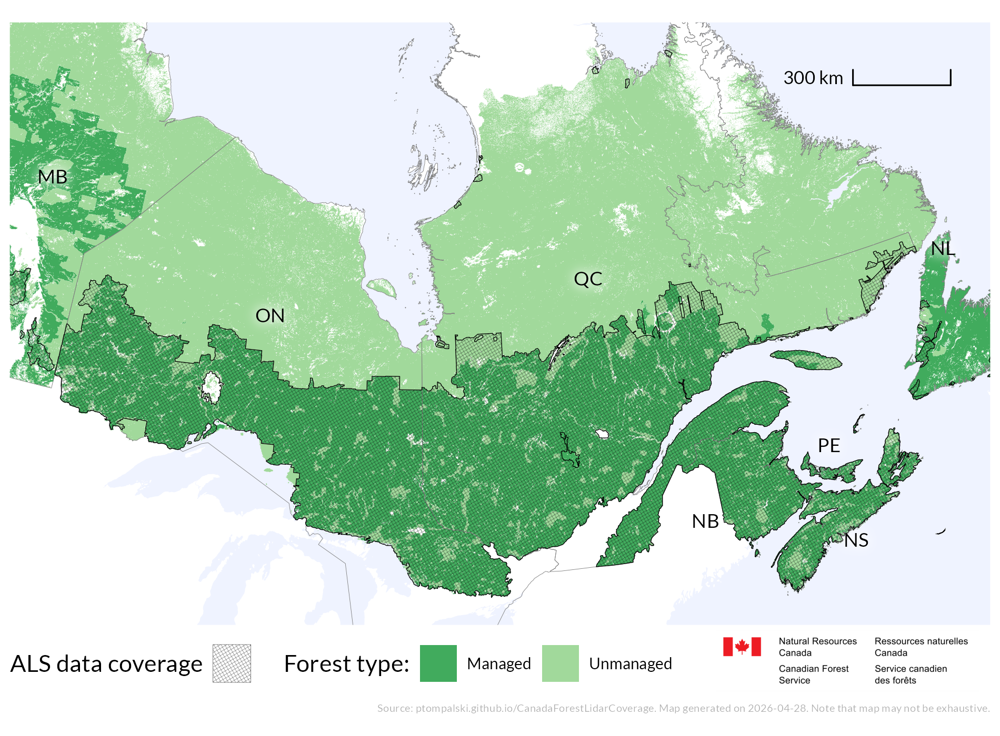
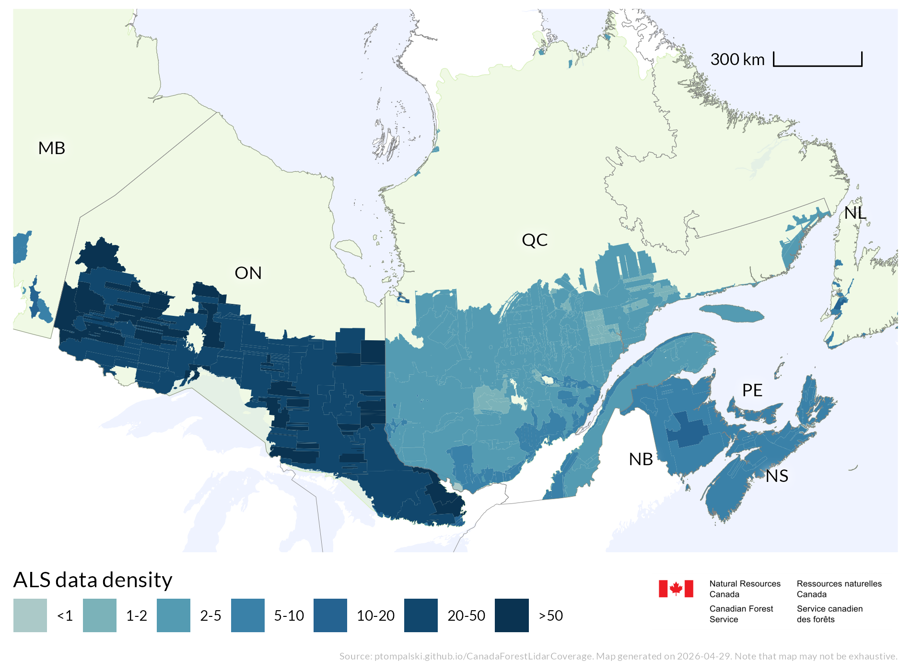
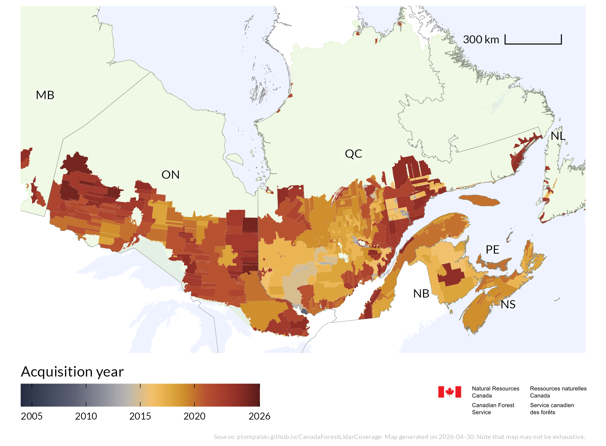
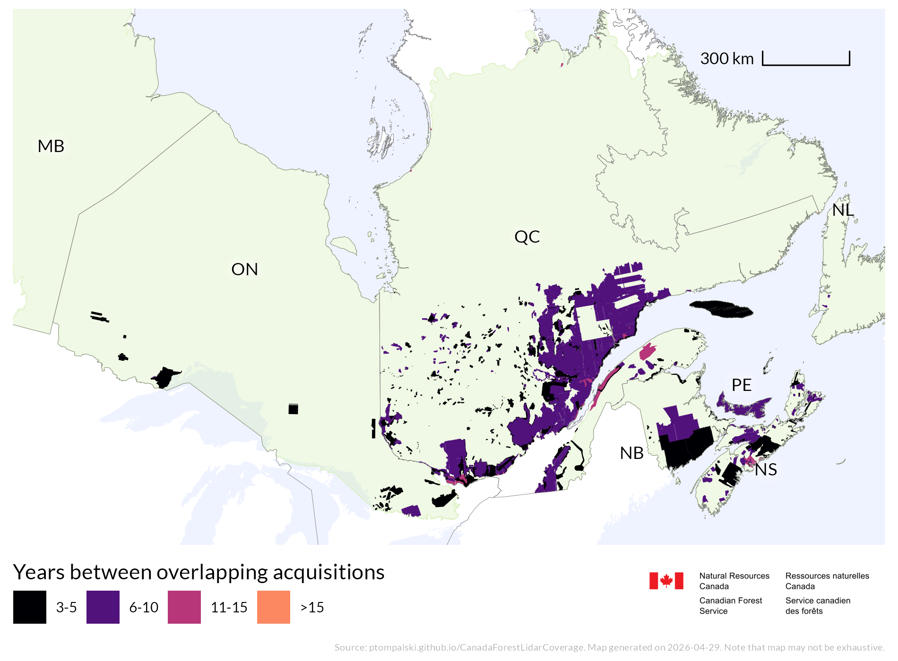

<style>
#title-block-header,
#quarto-header,
#quarto-header-headroom {
  display: none !important;
}
</style>

```{=html}
<header class="subpage-fixed-header">
  <div class="subpage-fixed-header-inner">
    <a href="index.html" class="subpage-site-mark">Canada Forest ALS</a>
    <nav class="subpage-topnav">
      <a href="index.html#interactive-map">Map</a>
      <a href="index.html#summary">Summary</a>
      <a href="data.html">Data sources</a>
      <a href="log.html">Updates</a>
      <a href="https://github.com/ptompalski/CanadaForestLidarCoverage">GitHub</a>
    </nav>
  </div>
</header>
<section class="column-screen subpage-hero-band">
  <div class="subpage-hero-copy">
    <p class="subpage-eyebrow">Static maps</p>
    <h1>Eastern Canada</h1>
    <p class="subpage-hero-lede">Regional static map layouts focused on Ontario, Quebec, and the Atlantic provinces. These pages keep the higher-detail cartographic views separate from the landing page overview.</p>
  </div>
</section>
<div class="subpage-main">
```

```{=html}
<nav class="subpage-jump-links" aria-label="Static map pages">
  <a class="subpage-jump-link" href="maps.html">
    <span class="subpage-jump-link-eyebrow">Static maps</span>
    <span class="subpage-jump-link-title">National overview</span>
  </a>
  <a class="subpage-jump-link" href="maps-west.html">
    <span class="subpage-jump-link-eyebrow">Static maps</span>
    <span class="subpage-jump-link-title">Western Canada</span>
  </a>
  <a class="subpage-jump-link is-current" href="maps-east.html">
    <span class="subpage-jump-link-eyebrow">Static maps</span>
    <span class="subpage-jump-link-title">Eastern Canada</span>
  </a>
  <a class="subpage-jump-link" href="multitemporal.html">
    <span class="subpage-jump-link-eyebrow">Static maps</span>
    <span class="subpage-jump-link-title">Multitemporal data</span>
  </a>
</nav>
```

## ALS coverage

{group="maps2"}

## Point density

{group="maps2"}

## ALS acquisition year

{group="maps2"}

## Areas of multiple acquisitions

{group="maps2"}

```{=html}
</div>
<section class="column-screen subpage-footer-wrap">
  <footer class="subpage-footer">
    <div class="subpage-footer-inner">
      <div>
        <p class="subpage-footer-title">ALS data coverage in Canadian forests</p>
        <p class="subpage-footer-copy">Static regional map products for eastern Canada.</p>
      </div>
      <nav class="subpage-footer-links">
        <a href="index.html">Home</a>
        <a href="maps.html">National overview</a>
        <a href="data.html">Data access</a>
        <a href="https://github.com/ptompalski/CanadaForestLidarCoverage">GitHub repository</a>
      </nav>
    </div>
  </footer>
</section>
```
