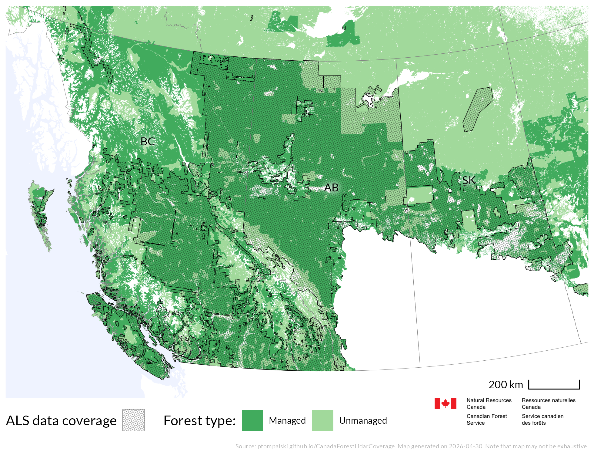
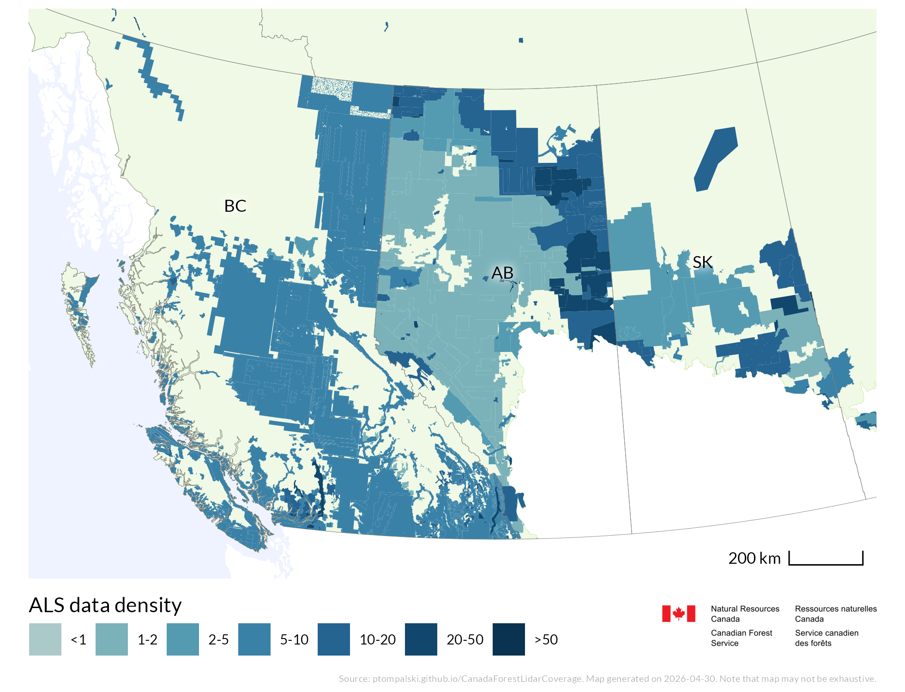
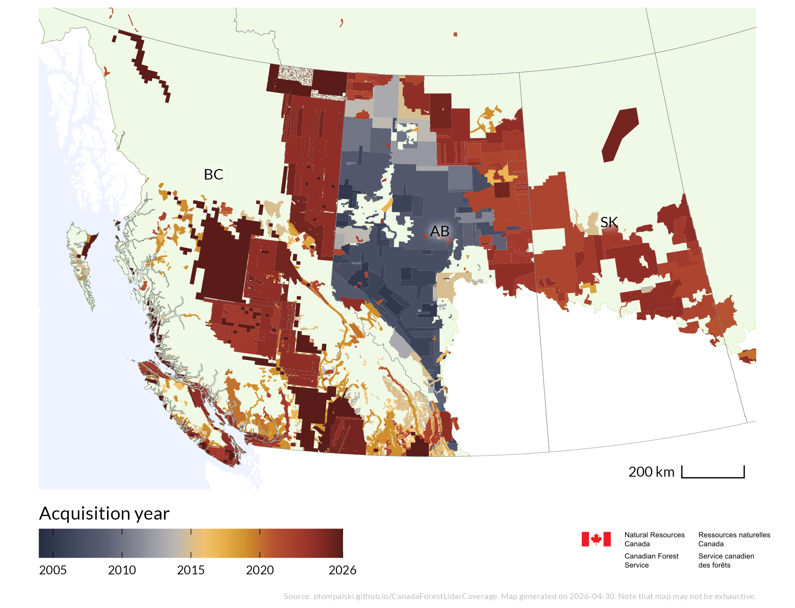
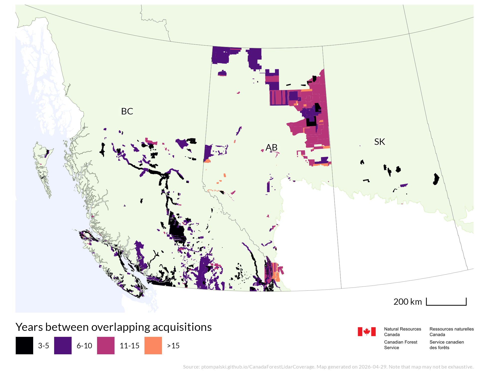

<style>
#title-block-header,
#quarto-header,
#quarto-header-headroom {
  display: none !important;
}
</style>

```{r, echo=FALSE, warning=FALSE, message=FALSE}
library(htmltools)
source("R/site_components.R")
coverage_file_date <- get_latest_coverage_date()
```

```{r, echo=FALSE, warning=FALSE, message=FALSE, results='asis'}
site_header()
```

```{=html}
<section class="column-screen subpage-hero-band">
  <div class="subpage-hero-copy">
    <p class="subpage-eyebrow">Static maps</p>
    <h1>Western Canada</h1>
    <p class="subpage-hero-lede">National and regional static map products show ALS coverage, point density, acquisition timing, and multitemporal overlap. They are updated as new acquisitions are added to the compilation.</p>
  </div>
</section>
<div class="subpage-main">
```

```{=html}
<nav class="subpage-jump-links" aria-label="Static map pages">
  <a class="subpage-jump-link" href="maps.html">
    <span class="subpage-jump-link-eyebrow">Static maps</span>
    <span class="subpage-jump-link-title">National overview</span>
  </a>
  <a class="subpage-jump-link is-current" href="maps-west.html">
    <span class="subpage-jump-link-eyebrow">Static maps</span>
    <span class="subpage-jump-link-title">Western Canada</span>
  </a>
  <a class="subpage-jump-link" href="maps-east.html">
    <span class="subpage-jump-link-eyebrow">Static maps</span>
    <span class="subpage-jump-link-title">Eastern Canada</span>
  </a>
  <a class="subpage-jump-link" href="multitemporal.html">
    <span class="subpage-jump-link-eyebrow">Static maps</span>
    <span class="subpage-jump-link-title">Multitemporal data</span>
  </a>
</nav>
```

## ALS coverage

{group="maps1"}

## Point density

{group="maps1"}

## ALS acquisition year

{group="maps1"}

## Areas of multiple acquisitions

{group="maps1"}

```{=html}
</div>
```

```{r, echo=FALSE, warning=FALSE, message=FALSE, results='asis'}
site_footer(coverage_file_date)
```
