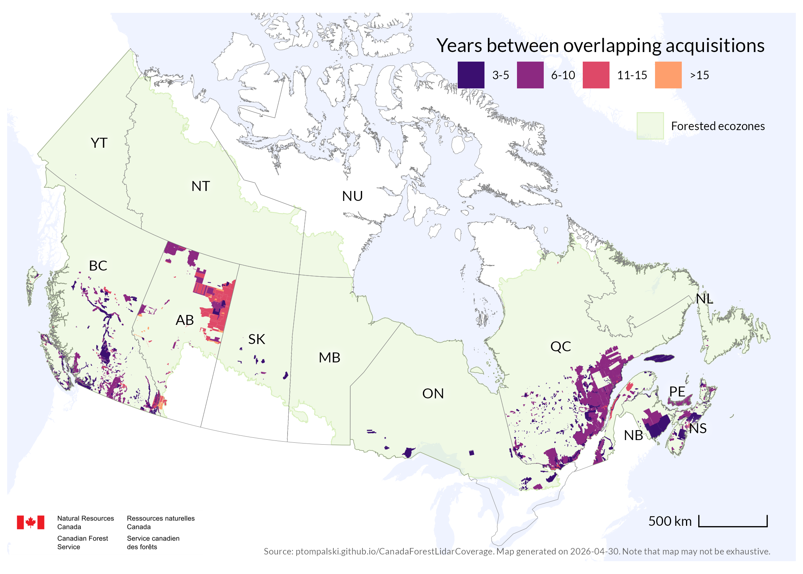

<style>
#title-block-header,
#quarto-header,
#quarto-header-headroom {
  display: none !important;
}
</style>

```{r, echo=F, warning=F, message=F}
source("R/0000_setup.R")
source("R/site_components.R")

summary_multitemporal_list <- readRDS("layers/summary_multitemporal_list.rds")
summary_multitemporal_Canada <- summary_multitemporal_list$summary_multitemporal_Canada
summary_multitemporal_managed <- summary_multitemporal_list$summary_multitemporal_managed
coverage_file_date <- get_latest_coverage_date()
```

```{r, echo=FALSE, warning=FALSE, message=FALSE, results='asis'}
site_header()
```

```{=html}
<section class="column-screen subpage-hero-band">
  <div class="subpage-hero-copy">
    <p class="subpage-eyebrow">Static maps</p>
    <h1>Multitemporal data</h1>
    <p class="subpage-hero-lede">Repeated ALS acquisitions identify areas that have been surveyed more than once. This page combines the national summary, provincial totals, and static overlap maps in one place.</p>
  </div>
</section>
<div class="subpage-main">
```

```{=html}
<nav class="subpage-jump-links" aria-label="Static map pages">
  <a class="subpage-jump-link" href="maps.html">
    <span class="subpage-jump-link-eyebrow">Static maps</span>
    <span class="subpage-jump-link-title">National overview</span>
  </a>
  <a class="subpage-jump-link" href="maps-west.html">
    <span class="subpage-jump-link-eyebrow">Static maps</span>
    <span class="subpage-jump-link-title">Western Canada</span>
  </a>
  <a class="subpage-jump-link" href="maps-east.html">
    <span class="subpage-jump-link-eyebrow">Static maps</span>
    <span class="subpage-jump-link-title">Eastern Canada</span>
  </a>
  <a class="subpage-jump-link is-current" href="multitemporal.html">
    <span class="subpage-jump-link-eyebrow">Static maps</span>
    <span class="subpage-jump-link-title">Multitemporal data</span>
  </a>
</nav>
```

::: {.subpage-copy-wide}
An area of `r format(as.numeric(summary_multitemporal_Canada$total_multitemporal_ALS_area, scientific=FALSE, big.mark=","))` km^2^ has been surveyed more than once using ALS, providing multitemporal coverage that represents about **`r round(summary_multitemporal_Canada$total_multitemporal_ALS_area_prop,1)`%** of Canada's land area and **`r round(summary_multitemporal_managed$total_managed_multitemporal_ALS_area_prop,1)`%** of managed forests.
:::

```{r, echo=F, warning=F, message=F}
summary_multitemporal_list$summary_multitemporal_byProvince %>%
  mutate(Jurisdiction = paste0(jurisdiction_name, " (", jurisdiction_code, ")")) %>%
  relocate(Jurisdiction) %>%
  select(-jurisdiction_name, -jurisdiction_code) %>%
  mutate(
    `Multitemporal ALS coverage` = paste0(
      format(
        round(as.numeric(multitemporal_ALS_area)),
        big.mark = ",",
        scientific = FALSE
      ),
      " (",
      round(multitemporal_ALS_area_prop, 1),
      "%)"
    )
  ) %>%
  select(
    -multitemporal_ALS_area,
    -multitemporal_ALS_area_prop,
    -managed_multitemporal_ALS_area,
    -managed_multitemporal_ALS_area_prop
  ) %>%
  knitr::kable()
```

## Areas of multiple acquisitions {#maps-overlap}

### National extent
{group="maps"}

### Western regional extent
{group="maps"}

### Eastern regional extent
{group="maps"}

```{=html}
</div>
```

```{r, echo=FALSE, warning=FALSE, message=FALSE, results='asis'}
site_footer(coverage_file_date)
```
